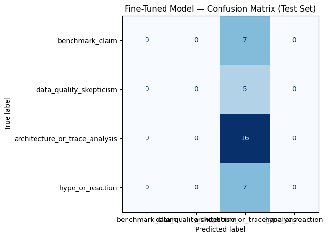

# TakeMeter — AgentTraceTakeMeter

Fine-tuned text classifier for **topic-centered public developer discourse** about Fable 5 traces, Fable-distilled models, agentic coding tools, and trace/dataset credibility.

See `planning.md` for label taxonomy and collection plan.

## Community

My chosen online community is a topic-centered public developer discourse community around Fable 5 traces, Fable-distilled models, agentic coding tools, and trace/dataset credibility. I sample primarily from Reddit AI/LLM communities and supplement with Hugging Face Discussions when they contain public human-written comments about the same artifacts. I am not claiming the exact same people participate on both platforms; I am treating them as overlapping public developer discourse spaces with shared norms around benchmark credibility, dataset provenance, trace usefulness, architecture/tool-use analysis, hype skepticism, and practical developer usefulness.

Raw Fable trace rows, CoT fields, and model outputs are not labeled as community takes; they are background artifacts that the community reacts to.

## Labels (4)

- `benchmark_claim`
- `data_quality_skepticism`
- `architecture_or_trace_analysis`
- `hype_or_reaction`

## Data collection (scrape script)

### Setup

```bash
python3 -m venv .venv
source .venv/bin/activate
pip install -r requirements.txt
cp .env.example .env
```

Fill in `.env` for PRAW mode (recommended).

### Quick try — json mode (no OAuth, may get HTTP 403)

Reddit often blocks unauthenticated scraping. If this fails, use **praw mode** below.

```bash
python scripts/scrape_reddit.py --mode json --max-urls 3
```

Outputs:

- `data/raw_discourse_items.csv` — flat items ready for labeling
- `data/raw_reddit_tree.csv` — tree fields (`comment_id`, `post_id`, `parent_id`, ...)

### Full scrape from seed URLs

```bash
python scripts/scrape_reddit.py --mode json
```

### PRAW mode (recommended)

1. Create a Reddit **script** app at https://www.reddit.com/prefs/apps (read-only is fine)
2. Copy `.env.example` → `.env` and fill in `REDDIT_CLIENT_ID`, `REDDIT_CLIENT_SECRET`, `REDDIT_USER_AGENT`

```bash
python scripts/scrape_reddit.py --mode praw
python scripts/scrape_reddit.py --mode praw --search
```

### Labeling web app

```bash
cd labeler
./run.sh
```

Open http://127.0.0.1:8000 (or the LAN URL printed by `run.sh`). Use **Dashboard → Quick add** or **Add / Import** for new takes; **Annotate** to label (keys 1–4).

See `labeler/README.md` for LAN access, safety, and cleanup.

## Manual review of AI pre-labels

Pre-labeled files are in `data/`:

- `data/items_export_230_prelabeled.csv` — full 230-row export (211 AI labels + 19 skip)
- `data/labeled_dataset_prelabeled_review_needed.csv` — 211-row training-style subset (import as pre-labeled)

### Avoid duplicate imports (reset DB first)

```bash
# Option A: one command (backup + wipe + import)
bash scripts/reset_labeler_db.sh --import

# Option B: manual (what you discussed)
cp labeler/items.db labeler/items.db.backup-before-reset
rm labeler/items.db
python3 scripts/import_prelabeled.py
```

### Review in the labeler

```bash
cd labeler
./run.sh
```

1. Open **Annotate** — queue defaults to **Review AI labels first**
2. Rows with `needs_review` show the AI suggestion pre-selected and a yellow badge
3. Press **1–4** to change label if needed, **Enter** to confirm (marks `labeled`), **s** to skip
4. Watch dashboard counts — current AI distribution is architecture-heavy (~57%)

### Export and validate final dataset

```bash
# From labeler Dashboard → Export training CSV, save as:
# data/labeled_dataset.csv

python3 scripts/validate_labeled_dataset.py data/labeled_dataset.csv
```

Optional downsampling if `architecture_or_trace_analysis` still dominates:

```bash
python3 scripts/make_final_dataset.py \
  -i data/items_export_230_prelabeled.csv \
  -o data/labeled_dataset.csv \
  --max-per-label 85
```

(Only use `make_final_dataset.py` after rows are `status=labeled` in an export.)

## Data collection summary

| Item | Value |
|------|-------|
| Candidates collected | 230 |
| Manually reviewed (`labeled`) | 211 |
| Excluded (`skip`) | 19 |
| Platforms | Reddit + Hugging Face Discussions |
| Final export | `data/labeled_dataset.csv` |

**Label distribution (211 reviewed rows):**

| Label | Count | Share |
|-------|------:|------:|
| `architecture_or_trace_analysis` | 106 | 50.2% |
| `benchmark_claim` | 45 | 21.3% |
| `data_quality_skepticism` | 31 | 14.7% |
| `hype_or_reaction` | 29 | 13.7% |

No single label exceeds 70%. See `data/bundle_dataset_sample.md` for schema and examples. Three difficult annotation cases are documented in `data/difficult_cases.md`.

## Fine-tuning approach

- **Notebook:** [`ai201_project3_takemeter_starter_clean.ipynb`](ai201_project3_takemeter_starter_clean.ipynb) (Colab, T4 GPU)
- **Model:** `distilbert-base-uncased` + 4-class classification head
- **Split:** 70% train / 15% val / 15% test (stratified, `random_state=42`)
- **Hyperparameters (defaults):** 3 epochs, batch size 8, learning rate `2e-5`, max length 256 tokens
- **Training rows in notebook run:** 230 (full labeler export uploaded to Colab)

> **Note:** For a cleaner re-run, filter `status == "labeled"` before training (211 rows) so `skip` rows are excluded.

## Baseline comparison

Zero-shot **Groq** `llama-3.3-70b-versatile` using `prompts/groq_baseline_prompt.txt` (same definitions as the notebook `SYSTEM_PROMPT`).

| Model | Test accuracy (n=35) |
|-------|-------------------:|
| Zero-shot baseline (Groq) | **0.686** |
| Fine-tuned DistilBERT | **0.457** |

Full metrics: `results/evaluation_results.json`

### Per-class F1 (test set)

| Label | Baseline F1 | Fine-tuned F1 |
|-------|------------:|--------------:|
| `benchmark_claim` | 0.67 | 0.00 |
| `data_quality_skepticism` | 0.29 | 0.00 |
| `architecture_or_trace_analysis` | 0.81 | 0.63 |
| `hype_or_reaction` | 0.62 | 0.00 |

## Evaluation report



**What worked**

- The Groq baseline understood the four label definitions and beat the fine-tuned model overall (68.6% vs 45.7%).
- Manual review caught AI pre-label mistakes on boundary cases (see `data/difficult_cases.md`).

**What failed**

- Fine-tuned DistilBERT **collapsed to the majority class** (`architecture_or_trace_analysis`): 19/35 test errors were non-architecture comments predicted as architecture.
- Class imbalance (~50% architecture) plus overlapping vocabulary (many comments mention tools, traces, or metrics in passing) made fine-tuning harder than zero-shot classification with explicit definitions.

**Error patterns (from notebook wrong-prediction dump)**

1. Personal metric anecdotes (`benchmark_claim`) misread as architecture because they mention Claude Code metrics.
2. Short skeptical posts (`hype_or_reaction`) misread as architecture when any tooling keyword appears.
3. Chart/benchmark skepticism (`benchmark_claim`) confused with architecture when Reddit scrape metadata is noisy.

## Reflection

This project showed that **subjective developer-discourse labels are hard for small fine-tuned encoders** without more data and balancing. The zero-shot LLM baseline was stronger because the prompt encodes nuanced boundary rules from `planning.md`. If I continued, I would: (1) train only on `status=labeled` rows, (2) downsample architecture to ~85/label, (3) try class weights or focal loss, and (4) add a keyword/metadata filter for scraped Reddit boilerplate.

## Demo video

Script draft: [`docs/demo_script.md`](docs/demo_script.md) (~3–4 min outline).

**TODO:** Record screen capture, upload, and paste link here:

`Demo video: <your link>`

## AI Usage Plan / Disclosure

| Stage | Tool | What it did | What I verified |
|-------|------|-------------|-----------------|
| Pre-labeling | ChatGPT / Cursor-assisted workflow | Suggested labels + notes for ~211 rows | Every row manually reviewed in `labeler/` (`needs_review` → `labeled`) |
| Label definitions | AI-assisted drafting | Helped refine 4-label taxonomy in `planning.md` | I merged to spec-safe 4 labels and wrote edge-case rules |
| Baseline | Groq `llama-3.3-70b-versatile` | Zero-shot classifier in Colab | Same prompt as `prompts/groq_baseline_prompt.txt` |
| Fine-tuning | Google Colab + Hugging Face Trainer | DistilBERT training pipeline | I ran the notebook and analyzed outputs |
| Homework write-up | Cursor | README evaluation + demo script draft | I reviewed all numbers against notebook outputs |

Final labels in `data/labeled_dataset.csv` are **my reviewed annotations**, not unverified model outputs.

## Repo layout

```
data/           labeled_dataset.csv, difficult_cases.md, bundle_dataset_sample.md
docs/           demo_script.md
prompts/        groq_baseline_prompt.txt
results/        evaluation_results.json, confusion_matrix.png
scripts/        scrape_reddit.py, import_prelabeled.py, validate_labeled_dataset.py
labeler/        local labeling web app (FastAPI)
sources/        seed_urls.txt, search_queries.txt
ai201_project3_takemeter_starter_clean.ipynb
```
